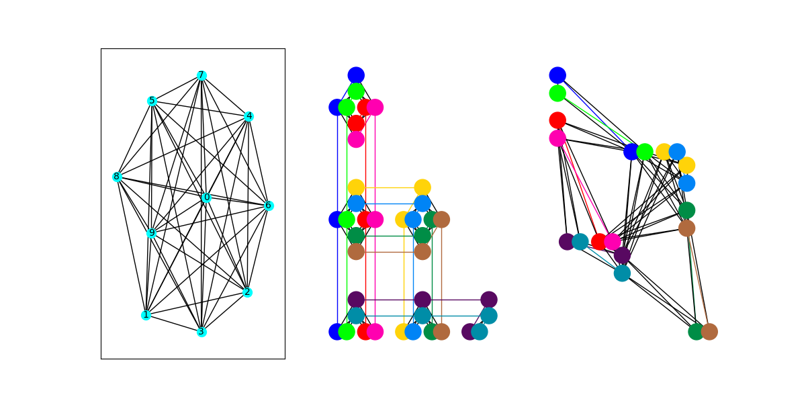
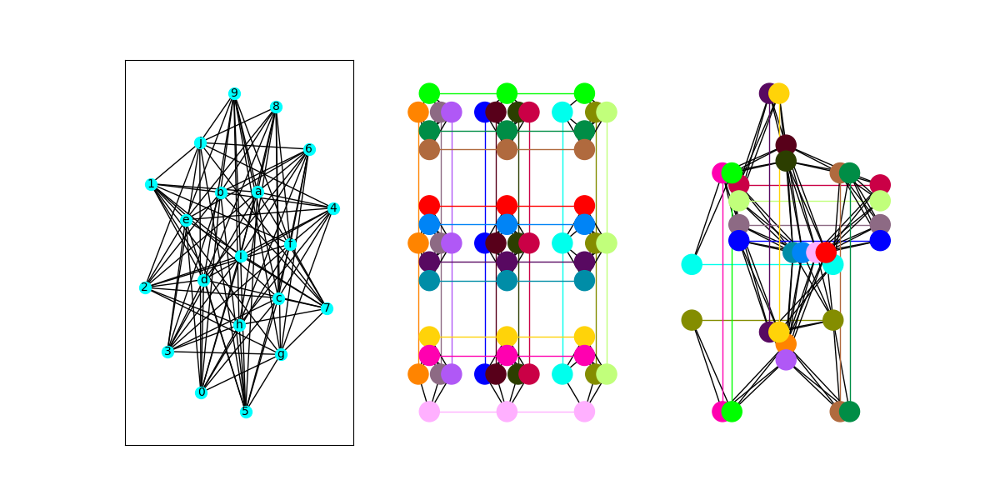

## pegasus topology

dwave uses chip topology called Pegasus
programs in this folder provide few different ways to explore the qubits and embeddings possible w/ Advantage (reffering to Pegasus? -no Advantage is the name of updated tech from their prev model - 2000Q))
(more info about architecture in this 22 page doc T-T https://www.dwavesys.com/media/s3qbjp3s/14-1049a-a_the_d-wave_advantage_system_an_overview.pdf)

## program descriptions

programs in this folder require token w/ access to advantage solver

#### 'get_props.py'

prints properties of online system that uses pegasus topology

#### 'get_available_qubits.py'

provides info on available qubits that can be programmed in online Advantage system

#### `get_inactive_qubits.py` 

each time a chip is calibrated, small number of qubits may not perform within required specs. these qubits become inactive, and can't be used in your calculations. program will show the # of inactive qubits in the online Advantage system.

#### `clique_embedding.py`

looks at how cliques (or complete graphs) can be embedded on the Pegasus topology. 

to run this program, type `python clique_embedding.py N`, where N is a pos int. program will attempt to embed a clique of size N onto a full P16 (the Pegasus topology at the scale of the Advantage chip).

#### `biclique_embedding.py`

looks at how bicliques (or complete bipartite graphs) can be embedded on the Pegasus topology.

to run this program, type `python biclique_embedding.py N`, where N is a pos int. program will attempt to embed a biclique of size N by N onto a full P16 (the Pegasus topology at the scale of the Advantage chip).

